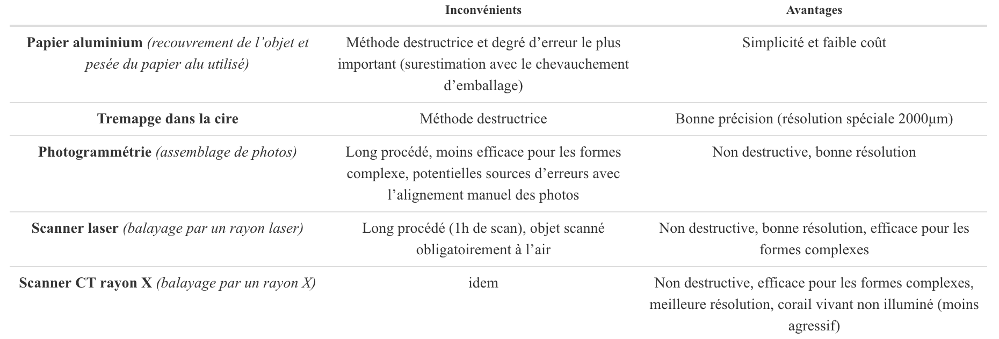
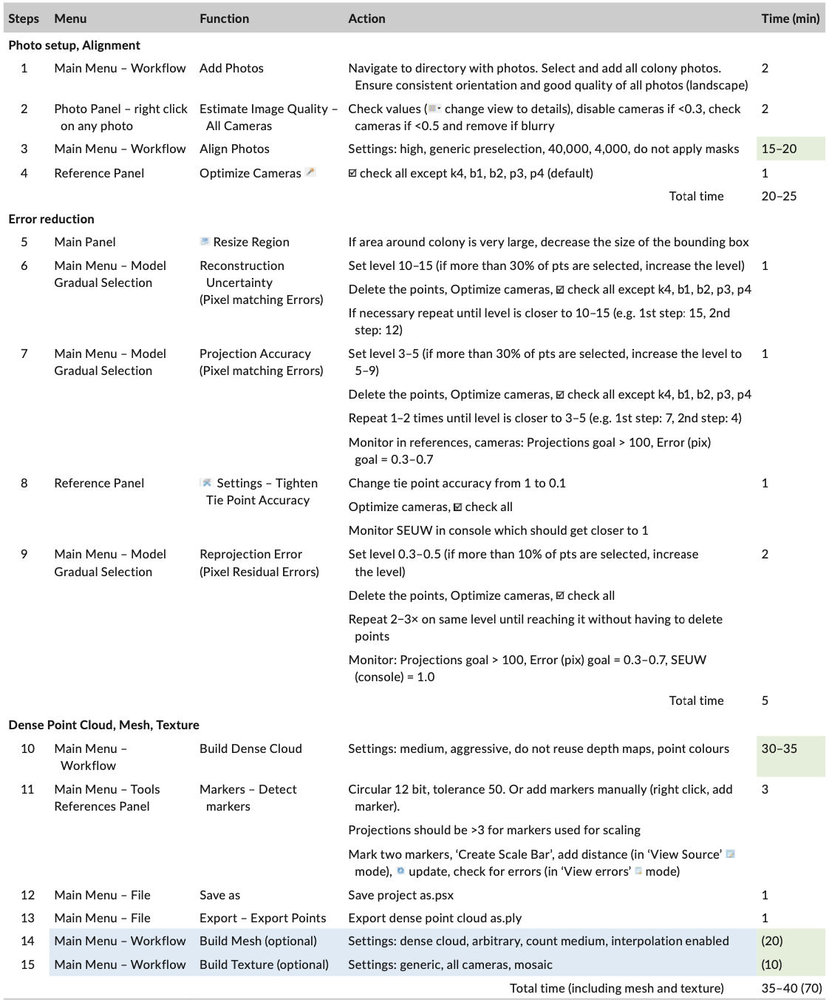
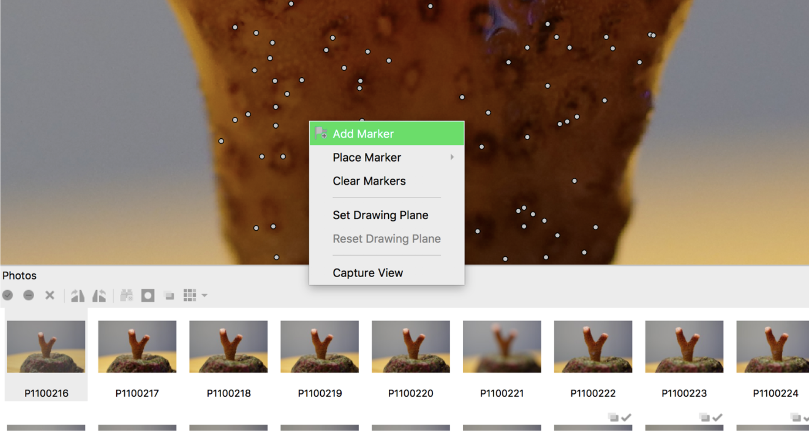
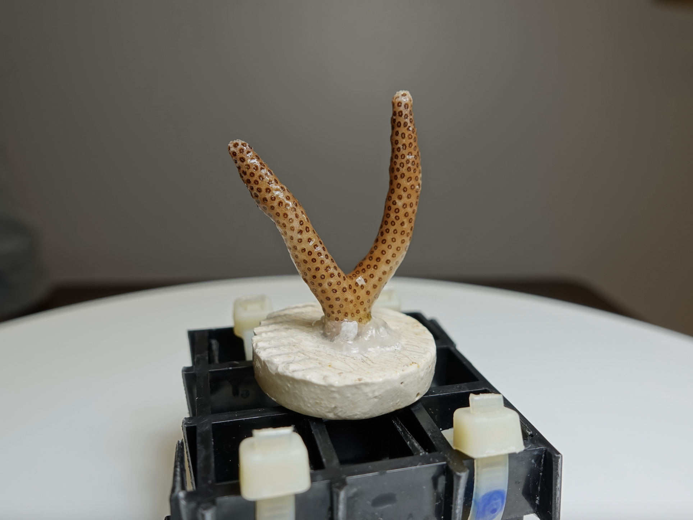

```{r echo = FALSE}
library(knitr)
```


<div style="text-align: justify">
# Table des matières
1. [Introduction](#introduction)

    [I- Enjeux socio-écologique lié aux écosystèmes coralliens global](#partieI)

    [II- Changement global et impacte sur récifs coralliens](#partieII)
    
    [III- Les techniques de mesure de la croissance corallienne](#partieIII)
    
    [IV- Cadre de l’étude](#partieIV)
    
2. [Matériel et méthodes](#Matériel et méthodes)

    [1) L'atelier pédagogique](#partie1)
    
    [2) Reconstruction 3D](#partie2)
    
    [3) Automatisation avec R studio](#partie3)
3. [Annexes](#Annexes)
4. [Références](#Références)


# Introduction <a name="introduction"></a>

## I- Enjeux socio-écologique lié aux écosystèmes coralliens global <a name="partieI"></a>

  Les récifs coralliens offrent aux populations humaines des milieux insulaires, une diversité de services, essentiels au maintien de l’économie du territoire. C'est en servant au secteur culturel que la valeur économique de ces écosystèmes est la plus importante [@wells_front_2006]. Leur beauté attire chaque année de nombreux voyageurs, et motive l’apparition d’un tourisme balnéaire associé à de nombreuses activités côtières : plongée, promenade en mer, école de surf et de voiles etc. La seconde source d’apports économiques, générée par les récifs, repose sur leur rôle de barrières de protection du littoral, de la houle et des ondes de tempêtes. Ils réduisent ainsi l’érosion des plages et fournissent des zones calmes pour la création des ports et la pratique de certaines activités nautiques (jet ski, voile, paddle etc). La richesse des récifs en ressources marines profite aux activités de pêches commerciales ou de subsidence (le rapport entre l’une et l’autre est variable selon les localités et dépend du niveau de développement du territoire). Pour certaines populations, les revenus économiques dépendent exclusivement de ces ressources et de leur diversité. A échelle mondiale. La valeur totale des récifs est estimée à 100 000$ à 600 000$ par kilomètre carré par an [@wells_front_2006]. Les chiffres varient considérablement au niveau national, ainsi que la part relative des différents services offerts par les écosystèmes.

  Avec les services qu’offrent les récifs pour les hommes, on ne doute pas des conséquences économiques et sociétales que pourrait entraîner leur disparition. Ces écosystèmes font l’objet d’un intérêt croissant auprès de la communauté internationale. On cherche à les inclure dans l’idée de la résilience d’un système socio-écologique, considérant les évolutions de l’environnement et de nos sociétés comme un ensemble  [@trebuil_resilience_2014]. Cela revient à réfléchir à comment un tel système pourrait répondre à des perturbations (voir II) tout en assurant la durabilité des usages humains et la conservation de la biodiversité. Dans cette perspective, plusieurs outils de gestion, de conservation et de protection des écosystèmes ont été proposés. Pour le secteur lié à la pêcherie récifale, entre autres, cela se traduit par la mise en place d’Aires Marines Protégées (AMPs), de récifs artificiels, de Dispositifs de Concentration de Poissons (DCP) ou le développement de l’aquaculture [@mahafina_perception_2021]. Parallèlement, afin de maintenir ces efforts et d’assurer leur succès, il est essentiel d’y impliquer les jeunes générations. Des programmes de sensibilisation sont mis en place par différentes structures (ONGs, parcs marins, réserves, aquariums, etc.) dans le but de faire connaître les récifs coralliens et leur fragilité. A terme, l’objectif est que les futures générations se sentent concernées et envisagent de s’impliquer dans la préservation de l’état de santé des écosystèmes.
  
## II- Changement global et impacte sur récifs coralliens <a name="partieII"></a>


  Depuis les années 50, un changement global du climat s’effectue à l’échelle de la planète. L’augmentation de l’activité anthropique est en effet responsable d’une importante émission de gaz à effet de serre dans l’atmosphère. On estime que 33% de ces gazs seraient absorbés par les océans chaque année [@woolf_key_2019]. Responsable d’une acidification des océans, l’augmentation du CO2 dissous et de l’acide carbonique aurait provoqué une baisse de 0,1 du pH des eaux de surface depuis l’ère industrielle. Les tendances à cette diminution varieraient entre 0,0014 et 0,0024 par an [@diouf_volet_2016]. Dans une étude menée sur les eaux Nord-Ouest de la Méditerranée en 2017, des chercheurs ont montré que la modification du pH est liée à 60% à la quantité de CO2 absorbée et à 40% à la température de l’eau [@kapsenberg_coastal_2017]. Or, avec le réchauffement atmosphérique, un renforcement de l’effet de serre naturel conduit à une hausse de la température moyenne de l’eau. Dans un rapport de 2021, le GIEC (Groupe intergouvernemental d'experts sur l'évolution du climat) prévoit une augmentation de la température moyenne de l’air de 1,5 °C d’ici 2030 [@coste_les_2021], entraînant un réchauffement encore plus important de la surface des océans. 

  Au niveau des récifs coralliens, ces phénomènes sont principalement responsables d’un blanchissement massif des récifs à l’échelle mondiale. Le stress écologique provoque une rupture de la symbiose entre les polypes de coraux et les zooxanthelles, privant ainsi la colonie de l’apport en nutriment que lui fournit la microalgue avec la photosynthèse [@brown_coral_1997]. Si la température reste élevée, la symbiose n’est pas renouvelée et la colonie meurt, laissant son squelette calcaire apparent. Bien que les coraux soient capables de récupérer d’un épisode de blanchissement qui ne persiste ou ne s’intensifie pas, il a été montré que le stress mène à la mort dans 50% des cas, entraînant alors une baisse importante de l’abondance des récifs [@dokken_5_2014]. On estime que près d’un tiers des coraux ont déjà disparu [@wells_front_2006] et, d’après les prévisions du GIEC, on peut s’attendre à une modification conséquente de l’écosystème corallien dans les années à venir avec la multiplication des épisodes de blanchissement. La perte est estimée à 60% des récifs d’ici 2030 [@wells_front_2006]. La baisse du pH a également des conséquences sur les fonctions physiologiques des coraux. Elle diminue la disponibilité des ions Calcium de l’eau de mer entraînant sa saturation de l’aragonite. Pour les coraux dûrs cela implique une cristallisation plus difficile du minéral pour construire leur squelette calcaire [@shaw_natural_2015]. Les coraux ne présentent pas tous la même sensibilité à la modification de leur milieu et leurs réponses aux perturbations varient entre les espèces. De ce fait, une conséquence de l’acidification pourrait être de réduire la complexité des récifs en diminuant la diversité des espèces composant les récifs coralliens [@darling_evaluating_2012].


## III- Les techniques de mesure de la croissance corallienne <a name="partieIII"></a>  

  Plusieurs démarches scientifiques peuvent nécessiter de mesurer la croissance des coraux. Dans le cadre d’un programme de restauration des récifs par exemple, il est ainsi possible d’évaluer l’efficacité de l’opération menée. Une colonie corallienne est prélevée sur un récif et fragmentée en boutures qui sont mises à grandir en nurserie (ex-situ ou in-situ). Une fois leur réimplantation dans leur milieu naturel, on cherchera à suivre leur développement grâce à l’outil de mesure le plus adéquat [@page_microfragmenting_2018]. Celui-ci permettrait de fournir, de façon simple, les mesures les plus précises. Plusieurs paramètres peuvent qualifier la croissance corallienne : le taux de calcification, l’extension linéaire, le volume et l’aire de surface. Le paramètre à calculer est choisi selon la morphologie de la colonie (l’extension linéaire serait la méthode la plus adéquate pour une forme branchue). Selon les objectifs de l’étude, les techniques de mesure sont employées différentiellement ; dans certains cas on privilégiera la précision au détriment du corail par exemple. Sont rassemblées dans le tableau ci-dessous, les avantages et inconvénients de certaines méthodes de mesure de l’aire de surface, décrites dans l’étude comparative de Veal et ses associées [@veal_comparative_2010] ([Tableau 1](#fig:Tableau 1)). Cette liste n’est pas exhaustive et d’autres techniques ont été développées dans le même objectif, telles que la mesure de masse par pesée flottante ou par déplacement d’eau [@comeau_resistance_2019]).


*Tableau 1 : Comparaison des techniques de mesure de l’aire de surface d’un corail*

```{r echo = FALSE, out.width = "60%", fig.align = 'center'}


```

  La photogrammétrie tridimensionnelle (3D) permet l'obtention de mesures à partir de représentations 3D numériques d'objets à l'échelle. Elle est reconnue comme un outil puissant de quantification de la complexité structurelle des récifs coralliens [@urbina-barreto_quantifying_2021]. Cette méthode, encore peu utilisée pour quantifier la croissance et la morphologie individuelle des colonies, semble pourtant, la plus adaptée à la réalisation de telles mesures in-situ ou ex-situ et sans endommager l’animal (@olinger_growth_2019, @ferrari_3d_2017). L'une des limites de la photogrammétrie est de nécessiter un temps de traitement global relativement long (la durée de chaque étape est renseignée dans la dernière colonne du tableau de ([Annexe 1](#Annexe 1)).

## IV- Cadre de l’étude <a name="partieIV"></a>

  Les travaux présentés dans ce rapport de stage s’inscrivent dans le cadre du projet “Future Maore Reef”, lancé par l’Institut de Recherche pour le Développement (IRD) et le Parc naturel marin de Mayotte, avec l’appui du Centre Universitaire de Formation et de Recherche de Mayotte et l’Université de la Réunion. Pendant deux ans, les acteurs viseront à comprendre la relation de la population mahoraise avec l’environnement marin ainsi que la résilience de ses écosystèmes coralliens. Ils chercheront aussi à instaurer une conservation durable du milieu et mèneront des programmes de sensibilisation auprès des scolaires et du grand public à Mayotte [@cautain_future_2021]

  Ces programmes portent une grande responsabilité auprès des habitants de Mayotte ; celle de redorer leur image de l'océan, historiquement perçu comme une menace sur plusieurs aspects [@bensoussan_mer_2009]. Ces angoisses renvoient à des croyances préislamiques mahoraises selon lesquelles leur mer serait peuplée de créatures mythologiques surnaturelles. Une peur alimentée par les conséquences tragiques de l’immigration clandestine dont l’île est sujette. La menace maritime s’enrichit encore avec l’arrivée de la piraterie autour de l’archipel des Comores, impactant la ressource marine située à proximité de Mayotte. Les mahorais présentent ainsi des réticences face à la mer et peu savent y nager. Ses richesses d’exceptions permettent pourtant de nourrir des milliers de familles grâce la pêche et le lagon de 1 100 km2 pourrait rendre possible le développement de l’aquaculture. En visant la préservation de ces ressources, il paraît essentiel d’y intégrer la société qui en dépend et des programmes tels que ceux prévus par “Future Maore Reef” prennent alors tout leur sens. 

  Dans le cadre du volet pédagogique du projet, les élèves de primaire mahorais mèneront une expérimentation sur la croissance des coraux du lagon afin d’être intégrés à une démarche scientifique. Leur problématique : A quelle vitesse pousse le corail ? En parallèle, le même projet sera conduit par des élèves de l’école élémentaire de Bondy en région parisienne, sur des coraux provenant des bassins contrôlés de l’Aquarium Tropical de la Porte Dorée, à Paris. Après la modélisation en 3D des boutures (voir [Matériel et méthodes](#Matériel et méthodes)), la photogrammétrie permettra également d’étudier leur croissance sur la durée de l’étude. Dans ce contexte, il est pertinent d’utiliser cet outil de façon efficace et reproductible, en cherchant à s’acquitter du temps nécessaire au processus manuel de traitement des images sur ordinateur. La problématique de cette étude est la suivante : Jusqu’où peut-on conduire l’automatisation de la reconstruction 3D sur Metashape Pro ?

# Matériel et méthodes <a name="Matériel et méthodes"></a>

### 1) L'atelier pédagogique<a name="partie1"></a>

  Une première phase du programme pédagogique a été menée, à Paris, avec les écoliers de primaire de Bondy. Deux ateliers ont été mis en place pour l'étude : un atelier de bouturage et un atelier de prise de photos. Dans un premier temps, les enfants ont fragmenté une colonie de *Slylophora sp.* à l'aide d'une pince coupante pour obtenir 12 boutures de corail branchu. Celles-ci ont ensuite été collées sur des plots en céramique blanc, utilisés comme support ([Annexe 3](#Annexe 3)). Entre chaque coupe, la colonie est gardée dans un bassin contenant l'eau de son aquarium, afin de ne pas induire un stress supplémentaire qui pourrait compromettre la survie des fragments. Un système de studio portatif est conçu de sorte à réaliser une prise de photos exploitables pour le traitement photogrammétrique. Un appareil numérique Sony RX 100 IV est posé sur un trépier devant un plateau tournant *cablematic*, dont l’angle de rotation est réglé manuellement à 15° sur une télécommande. Les boutures sont maintenues fixées au centre du plateau et successivement photographiées sous différents angles, à une distance comprise entre 14 et 16 cm de l’objectif de l’appareil. 24 photos du fragment sont alors prises à distance, avec l’appareil commandé par un smartphone via une connexion wifi. Les coraux sont replacés dans un bassin, une fois que la prise de photos est effectuée. Les ateliers ont été menés en décembre 2021 et un renouvellement est prévu pour le mois de mai 2022, afin d’effectuer le suivi de la croissance des branches de *Slylophora sp.*.

### 2) Reconstruction 3D<a name="partie2"></a>

  La reconstruction en 3 dimensions des boutures de coraux s’effectue en quelques grandes étapes avec Agisoft Metashape Professional version 1.5.1 (logiciel) ([Annexe 1](#Annexe 1)). Après le chargement de la série de photos, une première étape consiste à estimer leur qualité. Dans le protocole de Lange et Perry, une qualité inférieure à 0,3 n’est pas suffisante pour que les photos soient utilisées pour la modélisation [@lange_quick_2020]. Celles-ci sont alors supprimées et les autres sont gardées afin de procéder à “l’alignement”. Ce traitement consiste à faire se recouvrir les images les unes avec les autres en les suturant avec leurs points semblables, détectés par le logiciel ou déterminés à la main ([Annexe 2](#Annexe 2)). Il s’agit souvent de points remarquables comme une petite tâche isolée par exemple. Cette étape du traitement est la seule sur laquelle une action peut être effectuée manuellement afin d’optimiser le rendu de la reconstruction 3D. Les erreurs potentielles dans la reconstruction sont réduites par la suppression des points au-dessus/en dessous de certains niveaux d’incertitude et de précision. Metashape permet ensuite la création d’un nuage de points dense et la mise à l’échelle est faite manuellement en associant des marqueurs aux points d’une règle, visible sur la photo. Afin d’estimer la précision de la modélisation 3D, on génère six modèles supplémentaires pour chacune des boutures, en retirant au hasard, 10% de l’ensemble des photos (d'après @ferrari_3d_2017). La précision (en mm) est calculée comme la distance moyenne entre chacun des 6 nuages de points, construits et alignés sur celui d’origine dans le logiciel CloudCompare version 2.10.2. 
 
### 3) Automatisation avec R studio<a name="partie3"></a>

  Un langage python a déjà été créé par Metashape afin d’utiliser le logiciel par ligne de commande et dans des programmes informatiques. Ici, l’automatisation du processus de reconstruction 3D se basera sur la création et le développement d’un package (ensemble de fonctions) pour R et utilisable sur Rstudio [@rstudio].  Il n’est pas envisagé que toutes les étapes de la modélisation puissent être automatisées. Cet algorithme permettra de commander les étapes de la reconstruction qui ne nécessitent pas de réglages subjectifs, comme l'ajout de points d’alignement sur les photos. Ainsi, grâce au package, les utilisateurs pourront rapidement procéder à l’estimation de la qualité des photos  sur Metashape par exemple. Ce portage, après avoir pris en main, nécessitera d’être complété par quelques fonctions complémentaires pour l’automatisation d’étapes telles que la détection automatique d’une règle pour la mise à l’échelle de l’objet. L’efficacité de la technique sera testée, en comparant la modélisation automatique de 3 boutures avec la méthode manuelle en suivant le protocole de Lange et Perry [@lange_quick_2020]. L'objectif est d'atteindre le même degré de précision par l'utilisation du package.

</div >


# Annexes<a name="Annexes"></a>

<center>Annexe 1 : Protocole de reconstruction 3D sur Metashape Pro (Lange et Perry 2020)<a name="Annexe 1"></a><center>
```{r echo = FALSE, out.width = "60%", fig.align = 'center'}


```

<center>Annexe 2 : Ajoût manuel d'un point d'alignement sur Metashape Pro<a name="Annexe 2"></a><center>
```{r echo = FALSE, out.width = "60%", fig.align = 'center'}


```

<center>Annexe 3 : Installation d'une bouture de *Slylophora sp.* sur son support<a name="Annexe 3"></a><center>
```{r echo = FALSE, out.width = "60%", fig.align = 'center'}


```

# Références<a name="Références"></a>