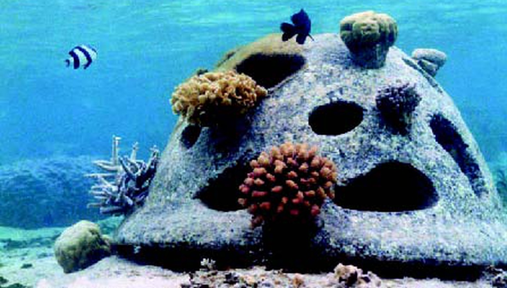
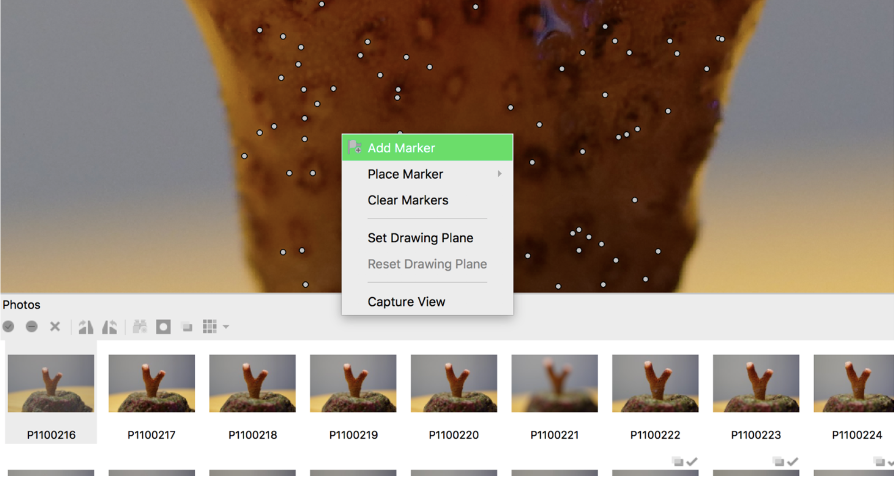
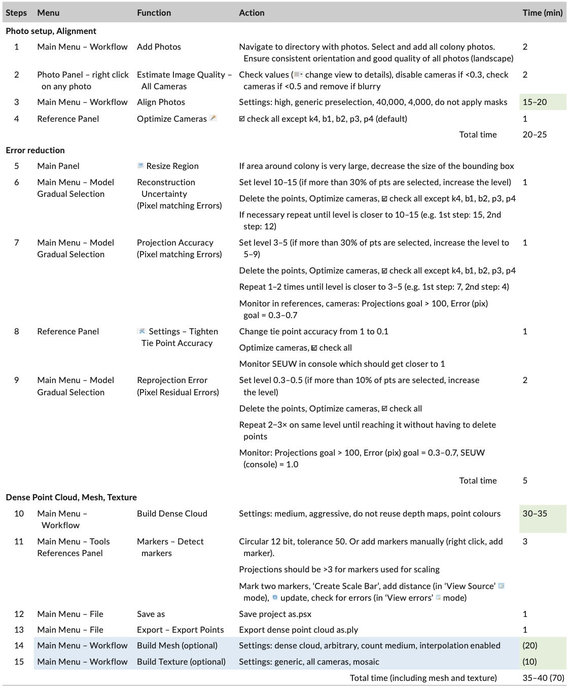

```{r echo = FALSE}
library(knitr)
```


<div style="text-align: justify">
### Table des matières
1. [Introduction](#introduction)

    [I- Changement global et impacte sur récifs coralliens](#partieI)
    
    [II- Enjeux socio-écologique lié aux écosystèmes coralliens global](#partieII)
    
    [III- Les techniques de mesure de la croissance corallienne](#partieIII)
    
    [IV- Cadre de l’étude](#partieIV)
    
2. [Matériel et méthodes](#Matériel et méthodes)


### Introduction <a name="introduction"></a>

#### I- Changement global et impacte sur récifs coralliens <a name="partieI"></a>

Depuis les années 50, un changement global du climat s’effectue à l’échelle de la planète. L’augmentation de l’activité anthropique est en effet responsable d’une importante émission de gaz à effet de serre dans l’atmosphère. On estime que 33% de ces gazs seraient absorbés par les océans chaque année [@woolf_key_2019]. Responsable d’une acidification des océans, l’augmentation du CO2 dissout et de l’acide carbonique aurait provoqué une baisse de 0,1 du pH des eaux de surface depuis l’ère industrielle. Les tendances à cette diminution varieraient entre 0,0014 et 0,0024 par an [@diouf_volet_2016]. Dans une étude menée sur les eaux Nord-Ouest de la Méditerranée en 2017, des chercheurs ont montré, que la modification du pH est liée à 60% à la quantité de CO2 absorbée et à 40% à la température de l’eau [@kapsenberg_coastal_2017]. Or, avec le réchauffement atmosphérique, un renforcement de l’effet de serre naturel conduit à une hausse de la température moyenne de l’eau. Dans un rapport de 2021, le GIEC (Groupe intergouvernemental d'experts sur l'évolution du climat) prévoit une augmentation de la température moyenne de l’air de 1,5 °C d’ici 2030 [@coste_les_2021], entraînant un réchauffement encore plus important de la surface des océans. 

Au niveau des récifs coralliens, ces phénomènes sont principalement responsables d’un blanchissement massif des récifs à l’échelle mondiale. Le stress écologique provoque une rupture de la symbiose entre les polypes de coraux et les zooxanthelles, privant ainsi la colonie de l’apport en nutriment que lui fournit la microalgue avec la photosynthèse. Si la température reste élevée, la symbiose n’est pas renouvelée et la colonie meurt, laissant son squelette calcaire apparent. Bien que les coraux soient capables de récupérer d’un épisode de blanchissement qui ne persiste ou ne s’intensifie pas, il a été montré que le stress mène à la mort dans 50% des cas, entrainant alors une baisse importante de l’abondance des récifs [@dokken_5_2014]. D’après les prévisions du GIEC, on peut s’attendre à une multiplication des épisodes de blanchissement et une modification conséquente de l’écosystème corallien dans les années à venir. La baisse du pH a également des conséquences sur les fonctions physiologiques des coraux. Elle diminue la disponibilité des ions Calcium de l’eau de mer entrainant sa saturation de l’aragonite. Pour les coraux durs cela implique une cristallisation plus difficile du minéral pour construire leur squelette calcaire [@shaw_natural_2015]. Les coraux ne présentent pas tous la même sensibilité à la modification de leur milieu et leurs réponses aux perturbations varient entre les espèces. De ce fait, une conséquence de l’acidification pourrait être de réduire la complexité des récifs en diminuant la diversité des espèces composant les récifs coralliens [@darling_evaluating_2012].

#### II- Enjeux socio-écologique lié aux écosystèmes coralliens global <a name="partieII"></a>

Les récifs coralliens offrent aux populations humaines des milieux insulaires, une diversité de services, essentiels au maintien de l’économie du territoire. C'est en servant au secteur culturel que la valeur économique de ces écosystèmes est la plus importante [@wells_front_2006]. Leur beauté attire chaque année de nombreux voyageurs, et motive l’apparition d’un tourisme balnéaire associé à de nombreuses activités côtières : plongée, promenade en mer, école de surf et de voiles etc. Les bénéfices économiques se font aussi indirectement car le développement touristique d’une île s’accompagne généralement d'un certain nombre d'infrastructures, comme des ports de plaisance, hôtels et restaurants sur la zone côtière. La seconde source d'apports économiques, générée par les récifs, repose sur leur rôle de barrières de protection du littorale, de la houle et des ondes de tempêtes. Ils réduisent ainsi l’érosion des plages et fournissent des zones calmes pour la création des ports et la pratique de certaines activités nautiques (jet ski, voile, paddle etc). La richesse des récifs en ressources marines profite aux activités de pêches commerciales ou de subsidence (le rapport entre l’une et l’autre est variable selon les localités et dépend du niveau de développement du territoire). Pour certaines populations, les revenus économiques dépendent exclusivement de ces ressources et de leur diversité. A échelle mondiale. La valeur totale des récifs est estimée à 100 000$ à 600 000$ par kilomètre carré par an [@wells_front_2006]. On note qu’au niveau national, les chiffres varient considérablement ainsi que la part relative des différents services offerts par les écosystèmes.

  Avec les services qu’offrent les récifs pour les hommes, on ne doute pas des conséquences économiques et sociétales que pourraient entrainer leur disparition. C’est pourtant près d'un tiers des coraux qui ont déjà disparu et on estime une perte de 60% d'ici 2030 [@wells_front_2006].  Les écosystèmes coralliens font l’objet d’un intérêt croissant auprès de la communauté́ internationale. On cherche à les inclure dans l’idée de la résilience d’un système socio-écologique (qui considère les évolutions de l’environnement et de nos sociétés comme un ensemble) [@trebuil_resilience_2014]. Cela revient à réfléchir à comment un tel système pourrait répondre à des perturbations tout en assurant la durabilité des usages humains et la conservation de la biodiversité. Dans cette perspective, plusieurs outils de gestion, de conservation et de protection des écosystèmes ont été proposés. Pour le secteur lié à la pêcherie récifale, entre autres, cela se traduit par la mise en place d’Aires Marines Protégées (AMPs), de récifs artificiels, de Dispositifs de Concentration de Poissons (DCP) ou le développement de l’aquaculture [ @mahafina_perception_2021]. Parallèlement, afin de maintenir ces efforts et d’assurer leur succès, il est essentiel d'y impliquer les jeunes générations. Des programmes de sensibilisation sont mis en place par toutes sorte de structures (ONGs, parcs marins, réserves, aquariums etc) dans le but de faire connaître les récifs coralliens et leur fragilité. A terme, l’objectif est que les futures générations envisagent de s’impliquer (directement ou indirectement) dans la préservation de l’état de santé des écosystèmes. 

#### III- Les techniques de mesure de la croissance corallienne <a name="partieIII"></a>  

Plusieurs démarches scientifiques peuvent conduire à vouloir mesurer la croissance des coraux. Dans le cadre d’un programme de restauration des récifs par exemple, il est possible d’évaluer ainsi, l’efficacité de l’opération menée. Des colonies coraliennes peuvent être prélevées sur les récifs, fragmentées en plusieurs boutures et mise à grandir en nurserie (ex-situ ou in-situ). Une fois leur réimplantation dans leur milieu naturel, on cherche ensuite à suivre leur développement grâce à l’outil de mesure le plus adéquat [@page_microfragmenting_2018]. Celui-ci permettrait de fournir, le plus simplement, des mesures relativement précises du modèle étudié. Plusieurs paramètres peuvent qualifier la croissance d’une colonie corallienne : le taux de calcification, l’extension linéaire, le volume, l’aire de surface. Le paramètre à calculer est choisi selon la morphologie de la colonie (l’extension linéaire serait la méthode la plus adéquate pour une forme branchue). Selon les objectifs de l’étude, les techniques de mesure sont employées différentiellement ; dans certains cas on privilégiera la précision au détriment du corail par exemple. Sont rassemblées dans le tableau ci-dessous, les avantages et inconvénients de certaines méthodes de mesure de l’aire de surface, décrites dans l’étude comparative de Veal et ses associées [@veal_comparative_2010] ([Tableau 1](#fig:Tableau 1)). Cette liste n’est pas exhaustive et d’autres techniques ont été développées dans le même objectif (tel que la mesure de masse par pesée flottante ou par déplacement d’eau [@comeau_resistance_2019]).


<center> Tableau 1 : Comparaison des techniques de mesure de l’aire de surface d’un corail</center>

|  | Inconvénients | Avantages |
|:-------:   |:-------:|:--------:|
| **Papier aluminium** *(recouvrement de l'objet et pesée du papier alu utilisé)* | Méthode destructrice et degré d’erreur le plus important (surestimation avec le chevauchement d’emballage)  | Simplicité et faible coût  |
| **Tremapge dans la cire** | Méthode destructrice | Bonne précision (résolution spéciale 2000μm) |
| **Photogrammétrie** *(assemblage de photos)* | Long procédé, moins efficace pour les formes complexe, potentielles sources d’erreurs avec l’alignement manuel des photos | Non destructive, bonne résolution |  
| **Scanner laser** *(balayage par un rayon laser)* | Long procédé (1h de scan), objet scanné obligatoirement à l’air | Non destructive, bonne résolution, efficace pour les formes complexes | 
| **Scanner CT rayon X** *(balayage par un rayon X)* | idem | Non destructive, efficace pour les formes complexes, meilleure résolution, corail vivant non illuminé (moins agressif) | 


La photogrammétrie tridimensionnelle (3D) permet l'obtention de mesures à partir de représentations 3D numériques d'objets à l'échelle. Elle est reconnue comme un outil puissant de quantification de la complexité structurelle des récifs coralliens [@urbina-barreto_quantifying_2021]. Cette méthode, encore peu utilisée pour quantifier la croissance et la morphologie individuelle des colonies, semble pourtant, la plus adaptée à la réalisation de telles mesures in-situ ou ex-situ et sans endommager l’animal (@olinger_growth_2019, @ferrari_3d_2017). L'une des limites de la photogrammétrie est de nécessiter un temps de traitement global relativement long (le temps de chaque étape est renseigné dans la dernière colonne du tableau de ([Annexe 1](#Annexe 1)).

#### IV- Cadre de l’étude <a name="partieIV"></a>

Les travaux présentés dans ce rapport de stage s’inscrivent dans le cadre du projet “Future Maore Reef”, lancé par l’Institut de Recherche pour le Développement (IRD) et le Parc naturel marin de Mayotte, avec l’appui du Centre Universitaire de Formation et de Recherche de Mayotte et l’Université de la Réunion. Pendant deux ans, les acteurs viseront à comprendre la relation de la population mahoraise avec l’environnement marin ainsi que la résilience de ses écosystèmes coralliens. Ils chercheront aussi à instaurer une conservation durable du milieu et mèneront des programmes de sensibilisation auprès des scolaires et du grand public à Mayotte [@cautain_future_2021]

Ces programmes portent une grande responsabilité auprès des habitants de Mayotte ; celle de redorer leur image de l'océan, historiquement perçu comme une menace sur plusieurs aspects [@bensoussan_mer_2009]. Ces angoisses renvoient à des croyances préislamiques mahoraises selon lesquelles leur mer serait peuplée de créatures mythologiques surnaturelles. Une peur alimentée par les conséquences tragiques de l’immigration clandestine dont l’île est sujette (conditions de transport extrême dans des embarcations dangereuses et nombreux décès en mer). La menace maritime s’enrichie encore avec l’arrivée de la piraterie autour de l’archipel des Comores, impactant la ressource marine située à proximité de Mayotte. Les mahorais présentent ainsi des réticences face à la mer et, par exemple, peu savent y nager. Ses richesses d’exceptions permettent pourtant de nourrir des milliers de familles grâce la pêche et le lagon de 1 100 km2 pourrait rendre possible le développement de l’aquaculture. En visant la préservation de ces ressources, il parait essentiel d’y intégrer la société qui en dépend et des programmes tel que ceux prévus par “Future Maore Reef” prennent alors tout leur sens. 

Dans le cadre du projet, des structures en béton seront immergées dans le lagon mahorais afin de créer des récifs artificiels  ([Figure 1](#fig:Figure 1)). L'un de ces derniers sera réservé au volet pédagogique de Future Maore Reef, servant de support à un programme éducatif mené auprès d’élèves de primaire mahorais. L'objectif est de mettre en place une expérimentation sur la croissance des coraux afin d'intégrer les enfants à une démarche scientifique. Leur problématique : A quelle vitesse pousse le corail ? 
En parallèle, le même projet sera conduit sur des coraux provenant des bassins contrôlés de l’Aquarium Tropical de la Porte Dorée à Paris. Ceux-ci seront bouturés puis photographiés par des élèves de l'école élémentaire de Bondy en région parisienne.

Après la modélisation en 3D des boutures (voir [Matériel et méthodes](#Matériel et méthodes)), la photogrammétrie permettera également d’étudier leur croissance au cours de la durée de l'étude. Dans ce contexte, il est pertinent d'utiliser cet outil de façon efficace et reproductible, afin de reconstruire une image 3D des boutures de coraux rapidement visible par les enfants. L’idée est ainsi de chercher à s’acquitter du temps nécessaire au processus manuel de traitement des images sur ordinateur. La prolématique de cette étude est la suivante : Jusqu'où peut-on conduire l'automatisation de la reconstruction 3D sur Metashape Pro ? 

```{r echo = FALSE, out.width = "60%", fig.align = 'center', fig.cap = "Figure 1 : Exemple de récif artificiel en béton"}


```


### Matériel et méthodes <a name="Matériel et méthodes"></a>

1) L'atelier pédagogique

Une première phase du programme pédagogique a été menée, à Paris, avec les écoliers de primaire de Bondy. Deux ateliers ont été mis en place pour l'étude : un atelier de bouturage et un atelier de prise de photos. 
    Dans un premier temps, les enfants ont fragmenté une colonie de *Slylophora sp.* à l'aide d'une pince coupante pour obtenir 12 boutures de corail branchu. Celles-ci ont ensuite été collées sur des plots en céramique blanc, utilisés comme support. Entre chaque coupe, la colonie est gardée dans un bassin contenant l'eau de son aquarium, afin de ne pas induire un stress supplémentaire qui pourrait compromettre la survie des fragments.
    Un système de studio portatif est conçu de sorte à réaliser une prise de photos exploitables pour le traitement photogrammétrique. Un plateau tournant *cablematic*, dont l'angle de rotation est commendable manuellement grâce à une télécommande, est placé au centre d'une chambre ouverte en toile blanche *BeMatik*, réfléchissant la lumière. De part et d'autre, sont installées les deux lampes associées au kit de studio photo *BeMatik* avec leur ampoules de 35W. Un appareil photo numérique Sony RX 100 IV est posé sur un trépier devant l'ouverture de la chambre, à une distance de .... cm du plateau *cablematic*. 
    Les boutures sont successivement photographiées sous différents angles. Le pied du plot en céramique est imbriqué dans un trou d'un morceau de grille en plastique pour être maintenu au centre du plateau tournant. On définit un angle de rotation de ...° sur la télécommande. ... photos du fragment sont alors prises à distance, avec l'appareil commandé par un smartphone via une connection wifi. (Quelques images sont aussi prises du dessus de la bouture?). Les coraux sont replacés dans un bassin, une fois que la prise de photos est effectuée. 
Les ateliers ont été menés en décembre 2021 et un renouvellement est prévu pour le mois de mai 2022, afin d'effectuer le suivi de la croissance des branches de *Slylophora sp.*. 


2) Reconstruction 3D 

La reconstruction en 3 dimensions des boutures de coraux s’effectue en quelques grandes étapes avec Agisoft Metashape Professional version 1.5.1 (logiciel) ([Annexe 1](#Annexe 1)). Après le chargement de la série de photos, une première étape consiste à estimer leur qualité. Dans le protocole de Lange et Perry, une qualité est inférieure à 0,3 n’est pas suffisante pour que les photos soient utilisées pour la modélisation [@lange_quick_2020]. Celles-ci sont alors supprimées et les autres sont gardées afin de procéder à “l’alignement”. Ce traitement consiste à faire correspondre les images les unes avec les autres en les suturant avec leurs points semblables, détectés par le logiciel ou déterminés à la main ([Figure 2](#fig:Figure 2)). Il s’agit souvent de points remarquables comme une petite tâche isolée par exemple. Le logiciel détecte ainsi quelles images se recouvrent partiellement. Le mode “Générique” est appliqué lorsque, comme ici, les photos ne sont pas géoréférencées. 

```{r echo = FALSE, out.width = "60%", fig.align = 'center', fig.cap = "Figure 2 : Ajoût manuel d'un point d'alignement sur Metashape Pro"}


```

Cette étape du traitement est la seule sur laquelle une action peut être effectuée manuellement afin d’optimiser le rendu de la reconstruction 3D. En choisissant une haute précision (relative au nombre de points), le processus est plus lent mais on priorise la bonne estimation de la position des photos, conservées avec leur nombre originel de pixels. 
Après cette étape, les erreurs potentielles dans la reconstruction sont réduites en supprimant les points au-dessus/en dessous de certains niveaux d'incertitude et de précision. Plusieurs étapes successives de suppression de points et d’optimisation de caméras permettent d’atteindre l’objectif : réduire l’erreur (pix) à à 0,3–0,7 pour la plupart des images et le nombre final de points dans le nuage à environ 10 000-15 000.  

Metashape permet ensuite la création d’un nuage de points dense avec une précision moyenne, réduisant le temps de traitement. La mise à l’échelle est faite manuellement en ajoutant des marqueurs et en les associant à deux points d'une règle, visible sur la photo. Il est possible de générer un maillage de surface continu et texturé lorsque le modèle vise à être utilisé dans des présentations. Pour des analyses de volumes ou autre, c’est le nuage de points plus précis qui sera utilisé. 
Afin d’estimer la précision de la modélisation 3D, on génère six modèles supplémentaires pour chacune des boutures, à partir du même ensemble de photos après en avoir retiré 10% au hasard (d'après @ferrari_3d_2017). La précision (en mm) est calculée comme la distance moyenne entre chacun des 6 nuages de points, construits et alignés sur celui d’origine dans le logiciel CloudCompare version 2.10.2. 
 

3) Automatisation avec R studio

 Un language python a déjà été créé par Metashape afin d'utiliser le logiciel par ligne de commande et dans des programmes informatiques. Ici, l'automatisation du processus de reconstruction 3D se basera sur la création et le développement d'un package (ensemble de fonctions) pour R, utilisable sur l'interface graphique Rstudio [@rstudio]. Il n'est pas envisagé que toutes les étapes de la modélisaion puissent être automatisées. Cet algoritme permettra de commander les étapes de la reconstruction qui ne nécessitent pas de réglages subjetives, comme l'ajoût manuel de points d'alignement sur les photos. Ainsi, grâce aux fonctions du packages, les utilisateurs pourront rapidement procéder à l'ajoût de photos sur Metashape, l'estimation de la qualité des images ou encore l'optimation des cameras ([Annexe 1](#Annexe 1)). Ce portage, après avoir pris en main, nécessitera d'être complété par quelques fonctions complémentaires pour l'automatisation d'étapes telles que la détection d'automatique d'une règle pour la mise à l'échelle de l'objet.
    L'efficacité de la technique sera testée, pour un échantillon de 3 boutures, grâce à une comparaison de la modélisation automatique avec la méthode manuelle en suivant le protocol de Lange et Perry [@lange_quick_2020]. L'objectif est d'atteindre le même degré de précision par l'utilisation du package.

</div >

### Annexes

<center>Annexe 1 <a name="Annexe 1"></a></center>
```{r echo = FALSE, out.width = "60%", fig.align = 'center', fig.cap = "Protole de reconstruction 3D sur Metashape Pro (Lange et Perry 2020)" }


```

### Références